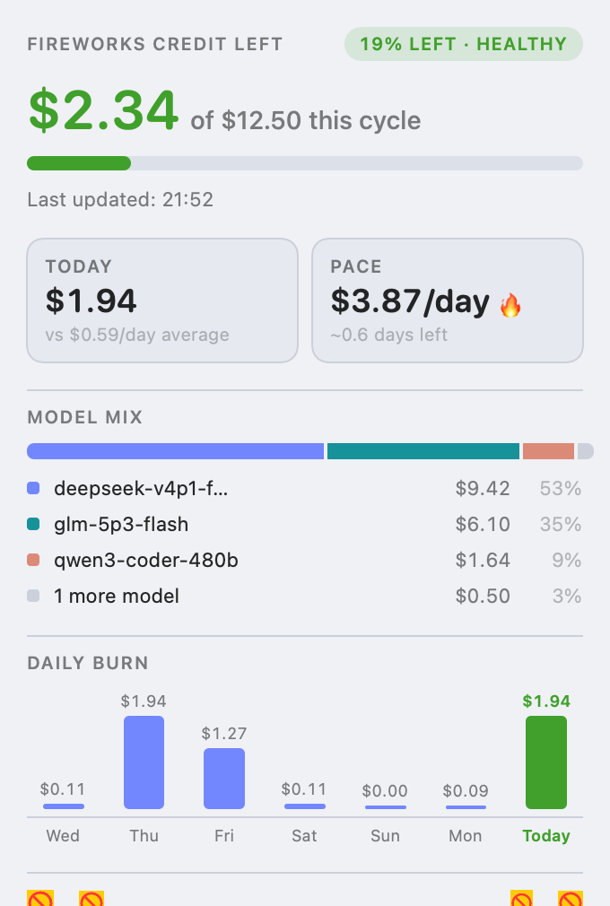
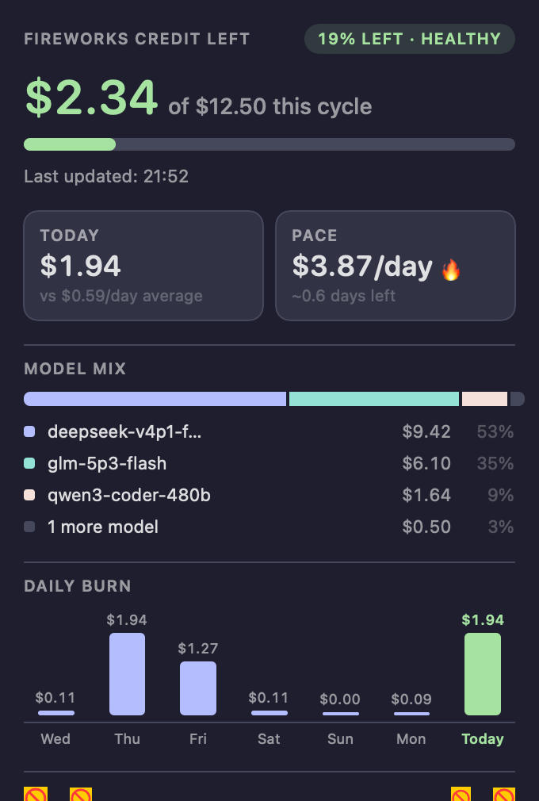
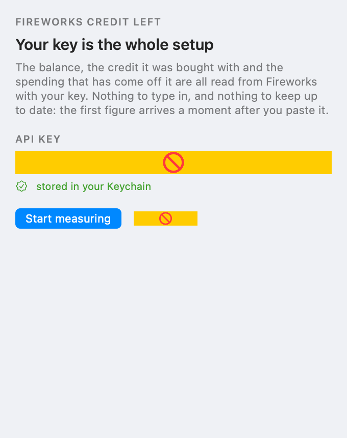
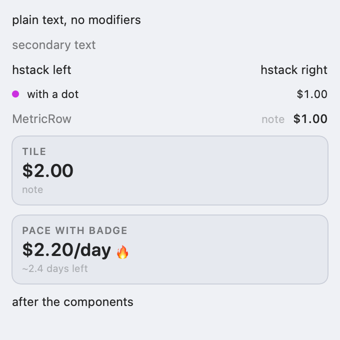

# Fireworks

**How much Fireworks AI credit you have left — in your menu bar, on your Home Screen, and on your iPhone. Read from Fireworks, not estimated.**


| Light | Dark |
|---|---|
|  |  |

---

## Why this exists

Fireworks is **prepaid**, and their **REST API does not return your balance**. It
returns rated *cost*. Every balance-shaped route was measured against the live
API and every one of them answers `404` — `billing/summary`, `billing/balance`,
`balance`, `credits`, `billing/usage`. The account object carries no balance
field either.

So the credit gauges that exist either ask you to type your balance in and
subtract from it, or don't exist. Both are bad: a typed-in figure is wrong the
moment you top up or miss a spend window, and it can't tell you what a
percentage is a percentage *of*.

The balance does exist, though — on the **control-plane gateway**. Fireworks'
own CLI is a gRPC client, and `firectl account get` prints `Balance: USD 7.75`
from `gateway.Gateway/GetBalance`. This app speaks that call directly: it is
HTTP/2, which `URLSession` already speaks, and the message is two fields wide, so
there is no gRPC library, no generated protos and no third-party dependency
involved (see [`Core/Sources/FireworksCore/Balance.swift`](Core/Sources/FireworksCore/Balance.swift)).

## What you get

- **A menu-bar dial that means something.** The arc is the fraction of your
  credit that is left, drawn from the real balance.
- **A popover with the context** — the figure, how much of it you have used,
  today's spend against your own daily average, a burn-rate forecast in days,
  the last seven days as a chart, and a per-model breakdown of where the money
  actually went.
- **Notifications** when 70% and 90% of your credit has been spent, and when the
  balance crosses lines you set. A top-up re-arms them, so they stay useful.
- **Widgets** for macOS Notification Center and iOS Home Screen.
- **An iPhone/iPad app** with the same numbers as the menu bar, from the same
  engine, so a figure read in one place means the same thing in the other.
- **Self-updating**, signed and verified, via [Sparkle](https://sparkle-project.org/).
- **Nothing to configure.** Paste an API key once; the key is the whole setup.

## Screenshots

| First run | In the menu bar |
|---|---|
|  |  |

The menu-bar item is a dial, not a number: it fills as you top up and empties as
you spend. It is drawn as a template image, so it takes the colour and weight of
the system menu bar and looks native in both appearances.

## Install

### Requirements

| | |
|---|---|
| macOS build | macOS 14 (Sonoma) or later |
| iOS build | iOS 17 or later |
| Building | Xcode 27 / Swift 6, [XcodeGen](https://github.com/yonaskolb/XcodeGen) (`brew install xcodegen`) |
| Account | any Fireworks account with an API key |

### Download

**[Fireworks-1.0.dmg](https://github.com/steveafrost/fireworks-app/releases/latest)** —
signed with a Developer ID certificate, notarized by Apple and stapled, so it
opens with no Gatekeeper warning. Open the disk image, drag Fireworks to
Applications, and paste an API key on first launch.

The app updates itself: new releases are published here and announced through the
signed [appcast](https://steveafrost.github.io/fireworks-app/appcast.xml), which
the app verifies against the Ed25519 public key compiled into it.

> A Homebrew cask is rendered by the release script (`Tools/fireworks.rb.in` →
> `build/fireworks.rb`, with the DMG's real `sha256`) but is not in a tap yet, so
> `brew install --cask fireworks` does not work today. Use the disk image.

### From source

```bash
git clone https://github.com/steveafrost/fireworks-app.git
cd fireworks-app

# the engine — 96 tests, no network, no simulator, no Xcode project
cd Core && swift test && cd ..

# the Mac app
xcodegen generate
xcodebuild -project Fireworks.xcodeproj -scheme Fireworks -configuration Debug \
  -destination 'platform=macOS' -derivedDataPath build/dd build
cp -R build/dd/Build/Products/Debug/Fireworks.app /Applications/
open -a /Applications/Fireworks.app
```

Debug builds are ad-hoc signed, so they run on any Mac with no Apple account.
Launch it, paste a key from
[app.fireworks.ai → API keys](https://app.fireworks.ai/settings/users/api-keys),
and the first reading arrives a moment later.

### Looking at the UI without screen-recording permission

The app can render its own panels offscreen, which is how the screenshots above
were produced on a Mac where screen capture is denied:

```bash
/Applications/Fireworks.app/Contents/MacOS/Fireworks \
  --render-ui /tmp/fireworks-ui --render-ui-sample --render-ui-dark
```

`--render-ui-sample` draws a synthetic reading, so the states a real account
only rarely reaches (low, critical, spent out) can be looked at. Two things it
cannot do, both of which have been mistaken for app bugs: text drawn straight
onto a transparent canvas is dropped (every panel is filled first), and
`Toggle`/`Button`/`Link` rasterize as a placeholder — check controls on screen,
use this for numbers and arrangement. The Settings pane is a SwiftUI `Form` and
comes out blank; its structure and copy are covered by tests instead.

## How it works

```
remaining = the balance Fireworks reports                  # the figure
credited  = the account's paid invoices, added up          # lifetime, history only
cycle     = what was available when credit was last added  # what it is out of
```

Nothing is subtracted, and nothing is typed in. The balance comes from
`gateway.Gateway/GetBalance`; the invoices come from
`gateway.Gateway/ListInvoices`, which returns the paid prepaid top-ups
`firectl billing list-invoices` prints (`$5 + $5 + $10 = $20.00` on the account
this was built against). An invoice that has been raised but not paid is
excluded — it has no amount on it, and an open invoice is not money in.

**`cycle` is what the percentages mean, and it is deliberately not the lifetime
total.** A denominator that can only grow makes the fraction fall forever: at
$20/month in and $20/month out the dial reads 17% after a month, 5–14% after six,
and 2.6–7.7% after a year. Worse, because the percent alerts re-arm only when a
threshold is *un*-crossed, 97% spent means warn-at-70 and warn-at-90 fire once
and then stay silent for the life of the account.

So the figure the dial divides by is the credit that was available at the last
top-up: the balance at that moment plus what arrived. It fills on a top-up,
empties as it is spent, and a top-up is what re-arms the windows — which is
exactly when re-arming means something.

- **Detecting a top-up is not a guess.** `ListInvoices` reports more paid than
  last time; the difference is what arrived, and the previous reading is the
  balance it arrived on top of.
- **On a first run** there is no cycle recorded, so it is rebuilt from the newest
  invoice instead — `balance + spend since that date`, the same figure arrived at
  from the other end. Only when the spend series is shorter than the gap since
  that top-up does it fall back to the lifetime total: wrong, labelled as such,
  and corrected by the next top-up.
- **When the gateway is unreachable**, the last balance it reported is shown
  marked `stale` under the bar, and the cycle is carried forward — an outage does
  not empty the dial or reset your alerts.
- **Alerts are keyed to the cycle, not the balance.** The balance changes every
  refresh; keying to it would re-fire or silently re-seed every threshold every
  five minutes.

## Layout

| Path | What it is |
|---|---|
| `Core/` | Swift package: the whole engine. No UI, no third-party dependencies |
| `Core/Sources/FireworksCore/` | API client, balance + invoice gateway calls, config, credit cycle, day series, alert planning, key handling |
| `Core/Tests/FireworksCoreTests/` | 96 tests, no network, no simulator (`swift test`) |
| `Mac/` | menu-bar app (no Dock icon; popover, settings, self-update) |
| `iOS/` | iPhone/iPad app |
| `Shared/` | the app-side half: `AppModel`, notifications, diagnostics, views, the offscreen renderer |
| `Widgets/` | WidgetKit extensions for both platforms |
| `project.yml` | XcodeGen spec for every target — this is the authored file; the `.xcodeproj` is its output |
| `RELEASE.md` | signing, App Group, notarization, TestFlight |
| `RELEASING.md` | how to cut an update: bump, archive, sign, rebuild the feed |
| `docs/appcast.xml` | the update feed the app reads (GitHub Pages, `docs/`) |

One engine, three surfaces. Nothing about *what the number is* is allowed to
exist twice, which is why the engine imports no AppKit/UIKit/SwiftUI: the Mac
app, the iOS app and every widget compile the same source. A widget extension
cannot make network calls on a useful schedule and cannot read the app's
container, so the app writes a small snapshot (balance, today, rate, days left,
the daily series) into the App Group container
(`group.com.whitebox.fireworks`) and the widgets render that.

Every rule that matters — the cycle arithmetic, the alert crossings, the
local-day boundaries, the key validation — is testable with `swift test` in
about thirty milliseconds, with no simulator and no network.

## Privacy

- **Your API key** is stored in the login Keychain (service `fireworks-app`).
  It is never written to disk in plaintext by this app, never logged, and never
  sent anywhere but Fireworks. If you used the
  [SwiftBar plugin](https://github.com/steveafrost/fireworks-menubar) first, the
  app picks up its key file and its settings instead of starting over.
- **Three calls go out**, all to Fireworks, all authenticated with that key:
  `usageCosts:query` over REST for spend, and `GetBalance` + `ListInvoices` over
  the gRPC gateway for the balance and the invoices behind it. Nothing else.
- **No telemetry, no analytics, no third-party SDK.** The only non-Apple
  dependency in the project is Sparkle, in the Mac app only, for updates.
- The iOS app is sandboxed and App Store-bound; the Mac app is deliberately not
  sandboxed (it reads a key from the Keychain and talks to one API), and is
  signed and notarized for distribution.

## Self-updates

The Mac app reads [`docs/appcast.xml`](docs/appcast.xml) and verifies every
release against an Ed25519 key baked into the binary before offering it. Checks
are daily by default and can be turned off in Settings → Updates; reminders are
deliberately quiet (no window is raised).

The private half of that key is **the one thing in this project that cannot be
regenerated**: if it is lost, every installed copy stops accepting updates,
because a replacement key can only be shipped inside a release those installs can
no longer accept. It is backed up outside the repository, and
[RELEASING.md](RELEASING.md) says where it lives and how to restore it.

## Status

- [x] Engine: API client, config, credit cycle, day series, alerts, Keychain, snapshots
- [x] 96 engine tests (`swift test`)
- [x] Mac menu-bar app, running against the live API
- [x] Popover, menu-bar dial, widgets and iOS app on one shared engine
- [x] Settings as a sidebar of six panes (Account, Balance, Alerts, General, Updates, About)
- [x] Notifications via `UNUserNotificationCenter`
- [x] Self-updating via Sparkle: feed live on GitHub Pages, offer path verified
      from a 1.0 copy against a 1.1 feed, quiet by default
- [x] Release signing: App Group granted, `.ipa` exported with an Apple
      Distribution certificate
- [x] Notarized DMG published as
      [v1.0](https://github.com/steveafrost/fireworks-app/releases/tag/v1.0), with
      an appcast entry whose Ed25519 signature verifies against the app's key
- [x] Widget *drawing on the Mac* — team-signed app and widget, App Group authorized
- [ ] TestFlight upload — needs the App Store Connect app record, then an upload
- [ ] Homebrew cask in a tap — the release script renders the cask file today

[RELEASE.md](RELEASE.md) has the commands, the verified output, and exactly what
still needs the Apple account.

## Contributing

Issues and pull requests are welcome. Two things make a change easy to accept:

1. **A test in `Core/`** if it touches arithmetic, thresholds or time. The engine
   is pure and fast and there is no reason for a rule to be verified by hand.
2. **A note in the doc comment** about *why*, not what. The interesting decisions
   in this codebase are the ones that look wrong until you know the reason (the
   cycle, the alert memory, the offscreen renderer's limitations) and each is
   explained where it lives.

Run the full suite before opening a PR:

```bash
cd Core && swift test
```

## License

[MIT](LICENSE) — do what you like with it.

## Related

- **[steveafrost/fireworks-menubar](https://github.com/steveafrost/fireworks-menubar)**
  — the SwiftBar plugin this app grew out of. Still the reference implementation
  for a single-file, dependency-free version of the same idea.
